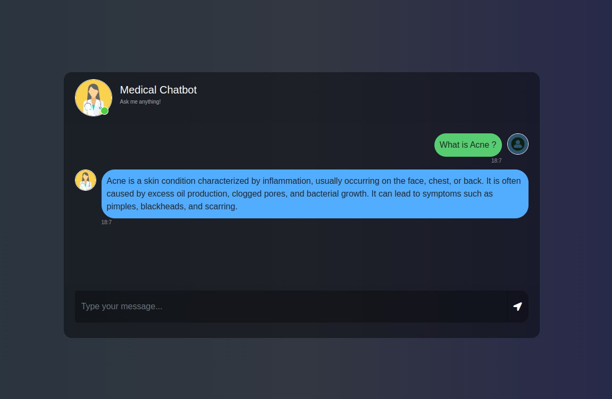

# Medical Chatbot

<p align="center">
  
</p>

## Introduction
A sophisticated AI-driven medical chatbot designed for accurate and efficient information retrieval. This system integrates advanced natural language processing (NLP) models with vector databases to provide precise responses based on medical literature. The chatbot supports large language models like **Llama 3.1** from Meta, offering scalable solutions for diverse healthcare applications.

---

## Project Structure

```
.
├── app.py                        # Main application entry point
├── data/                         # Data files for knowledge base
│   └── Gale Encyclopedia of Medicine. Vol. 2. 2nd ed.pdf
├── LICENSE                       # Project license
├── Medical_Chatbot.egg-info/     # Package metadata
│   ├── dependency_links.txt
│   ├── PKG-INFO
│   ├── SOURCES.txt
│   └── top_level.txt
├── notebooks/                    # Jupyter notebooks for testing and experiments
│   ├── CRUD_pinecone.ipynb
│   ├── RAG_without_systemprompt.ipynb
│   └── RAG_with_systemprompt.ipynb
├── README.md                     # Project documentation
├── requirements.txt              # List of dependencies
├── setup.py                      # Python package setup
├── src/                          # Core source code
│   ├── helper.py
│   ├── __init__.py
│   ├── prompt.py
│   └── __pycache__/
├── static/                       # Static files (CSS, assets)
│   └── style.css
├── store_to_vectordb.py          # Script for storing data into the vector database
└── templates/                    # HTML templates for the web interface
    └── chat.html
```

---

## Prerequisites

Before setting up the project, ensure the following tools are installed:

- [Python 3.10](https://www.python.org/downloads/release/python-3100/)
- [Conda](https://docs.conda.io/en/latest/miniconda.html) or `venv` for virtual environments
- [Ollama](https://github.com/ollama/ollama) for managing Llama models

---

## Installation Guide

### Clone the Repository

```bash
git clone https://github.com/devrahulbanjara/Medical-Chatbot.git
cd Medical-Chatbot
```

### Configure Environment Variables

Create a `.env` file in the root directory and add your Pinecone API key:

```
PINECONE_API_KEY="your-pinecone-api-key"
```

### Set Up the Virtual Environment

#### Using Conda:

```bash
conda create -n chatbot python==3.10 -y
conda activate chatbot
```

#### Using venv:

```bash
python3 -m venv chatbot
source chatbot/bin/activate  # Linux/macOS
chatbot\Scripts\activate     # Windows
```

### Install Dependencies

```bash
pip install -r requirements.txt
```

---

## Model Setup with Ollama

### Install Ollama

#### Linux:

```bash
curl -fsSL https://ollama.com/install.sh | sh
```

#### Windows:

Download the installer from the [Ollama official repository](https://github.com/ollama/ollama).

### Pull Llama 3.1 Model

Download the model suitable for your needs:

```bash
ollama pull llama3.1  # Default 8B model
```

To pull a larger model:

```bash
ollama pull llama3.1:70b  # 70B parameter model
```

For additional versions, refer to the [Ollama model library](https://ollama.com/library/llama3.1).

---

## Adding Custom Data Sources

Place any additional data files (in PDF format) inside the `data/` directory.

### Populate the Knowledge Base

Run the following script to ingest your data into the vector database:

```bash
python store_to_vectordb.py
```

---

## Running the Application

To start the chatbot application:

```bash
python app.py
```

---

## Contributing

Contributions are welcome. If you would like to contribute:

1. Fork the repository.
2. Create a new branch for your feature or bug fix.
3. Make your changes and commit them.
4. Submit a pull request (PR) for review.

We appreciate community contributions and will review pull requests promptly.

---

## License

This project is licensed under the [MIT License](./LICENSE).

---

## Acknowledgments

- [Meta AI](https://ai.facebook.com/research) for the Llama 3.1 model
- [Pinecone](https://www.pinecone.io/) for vector database services
- [Ollama](https://github.com/ollama/ollama) for seamless model integration

For more information, please refer to the official documentation or contact the project maintainers.

